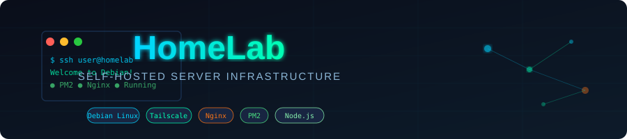
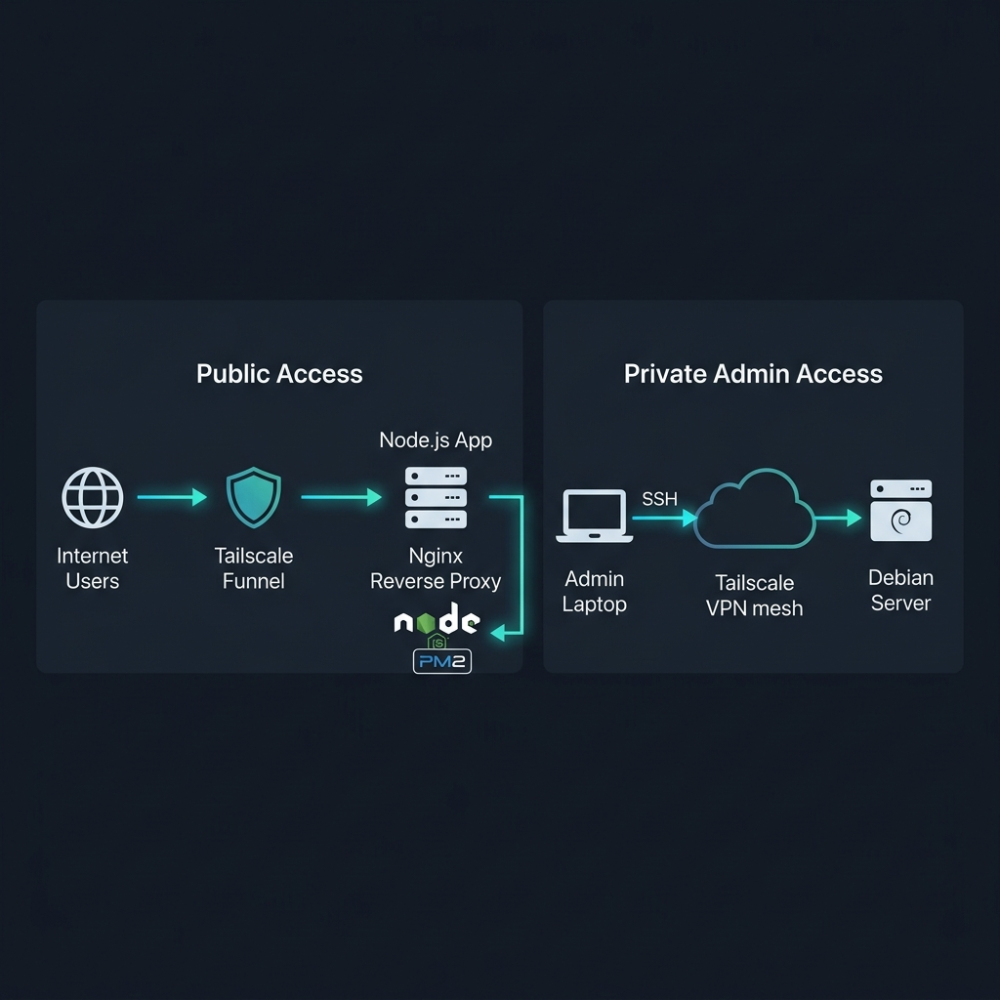
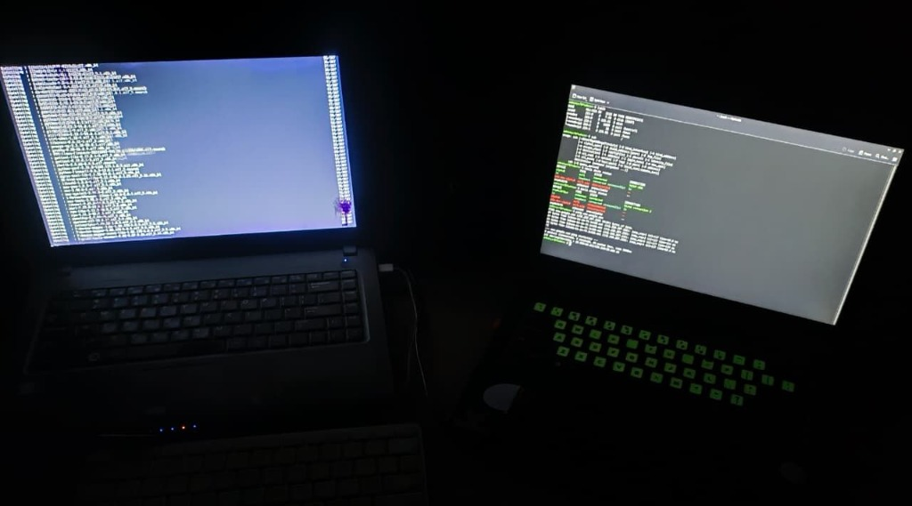
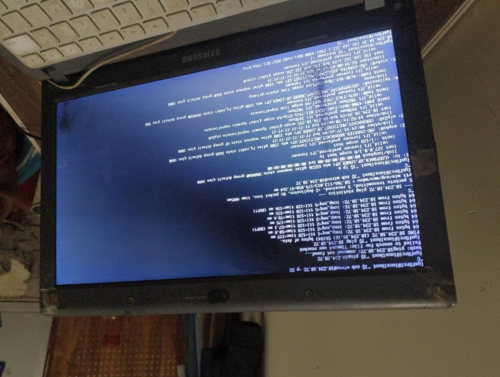
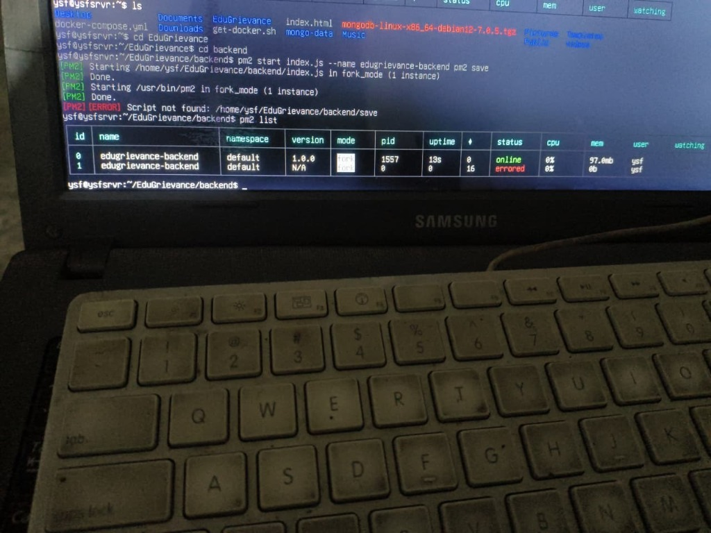
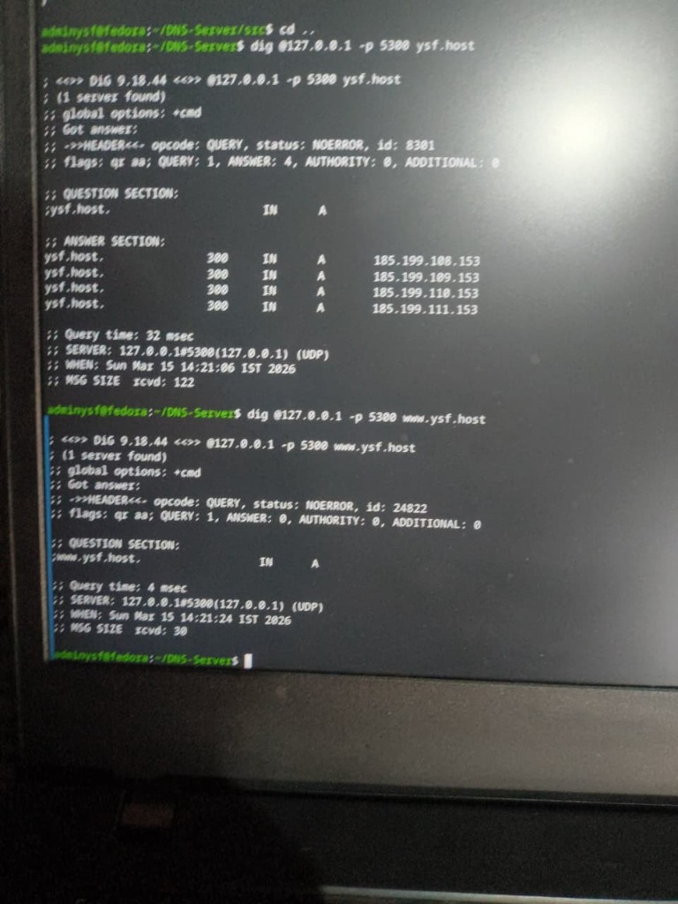

<p align="center">
  
</p>

<p align="center">
  
  &nbsp;
  
  &nbsp;
  
  &nbsp;
  
  &nbsp;
  
</p>

<br/>

> **Turn an old laptop into a production-grade server — for free.**
> This project documents how I built a complete self-hosted infrastructure using repurposed hardware, open-source tools, and zero cloud costs.

---

## 📋 Table of Contents

- [The Problem](#-the-problem)
- [System Architecture](#-system-architecture)
- [Tech Stack](#-tech-stack)
- [How I Built It](#-how-i-built-it)
- [Testing & Results](#-testing--results)
- [Challenges I Faced](#-challenges-i-faced)
- [Skills Gained](#-skills-gained)
- [Projects Hosted on This Server](#-projects-hosted-on-this-server)
- [What's Next](#-whats-next)

---

## 💡 The Problem

As a student and developer, I kept running into the same wall: **cloud hosting costs money**. Every project I built needed somewhere to live — and AWS, DigitalOcean, and similar platforms all add up fast.

I had an old Samsung laptop collecting dust. So I asked: *what if that becomes my server?*

These were the goals I set:

| Goal | Details |
|------|---------|
| 🆓 Zero recurring cost | No monthly cloud bills |
| 🔒 Secure remote access | Without opening risky router ports |
| 🌍 Public-facing apps | Accessible from anywhere on the internet |
| 📚 Real-world experience | Hands-on Linux, networking & DevOps skills |

---

## 🏗️ System Architecture

Here's how everything connects — from a user clicking a link to the response arriving from my living room:

<p align="center">
  
</p>

**Two separate access paths:**

- **Public Traffic** → Tailscale Funnel → Nginx → Node.js App (managed by PM2)
- **Admin Access** → My Lenovo laptop → Tailscale VPN → SSH into the Debian server

This separation means the server is reachable from the internet for serving apps, while I manage it privately through an encrypted VPN — no exposed ports, no risk.

<p align="center">
  
  <br/>
  <sub>📸 <em>The actual setup — Samsung server on the left, Lenovo admin laptop on the right, both running live</em></sub>
</p>

---

## 💻 Tech Stack

### Hardware

| Device | Role |
|--------|------|
| Samsung Laptop | Debian Linux headless server (also acts as a built-in UPS!) |
| Lenovo Laptop | Admin / management machine |
| Home ISP | Standard internet connection with continuous power |

### Software

| Tool | Purpose |
|------|---------|
| **Debian Linux** | Server OS — stable, lightweight, headless |
| **Tailscale** | WireGuard-based mesh VPN for secure private access |
| **Tailscale Funnel** | Securely exposes local services to the public internet |
| **Nginx** | Reverse proxy — routes incoming traffic to the right app |
| **Node.js** | Application runtime |
| **PM2** | Process manager — keeps apps alive 24/7 |
| **OpenSSH** | Remote terminal access |
| **Git & GitHub** | Version control and code deployment |

---

## 🚀 How I Built It

### Phase 1 — Setting Up the Server

Flashed a USB drive with the Debian Network Installer and installed it in **headless mode** (no desktop, no GUI — saves RAM and CPU).

Key setup steps:
- Configured a **static local IP** so the server always has the same address on my home network
- Enabled **SSH** to start automatically on boot
- Configured the laptop **not to sleep when the lid is closed**

```bash
# Prevent sleep on lid close
# Edit /etc/systemd/logind.conf
HandleLidSwitch=ignore
```

---

### Phase 2 — Secure Remote Access via Tailscale

Instead of port-forwarding port 22 on my router (which is a huge security risk), I used **Tailscale** — a zero-config VPN built on WireGuard.

Both my Samsung server and Lenovo laptop joined the same private Tailnet. Now I can SSH from anywhere in the world:

```bash
ssh user@<tailscale-ip>
```

No open ports. No exposed home IP. Just works.

<p align="center">
  
  <br/>
  <sub>📸 <em>Network interface config on the Samsung server — Tailscale mesh IPs visible alongside the local network</em></sub>
</p>

---

### Phase 3 — Running the Application

Installed Node.js and deployed my web app via Git. Then set up **PM2** to keep it running forever — even after crashes or reboots.

```bash
pm2 start server.js --name "portfolio-app"
pm2 save        # Save the process list
pm2 startup     # Auto-start on system boot
```

<p align="center">
  
  <br/>
  <sub>📸 <em>Real PM2 output on the Samsung server — EduGrievance backend deployed and running</em></sub>
</p>

---

### Phase 4 — Nginx Reverse Proxy

To cleanly route traffic (and allow multiple apps on different ports in the future), I set up **Nginx** as a reverse proxy.

Traffic flow:
```
Internet → Port 443 → Nginx → localhost:3000 (Node.js)
```

Created a server block in `/etc/nginx/sites-available/` with a `proxy_pass` directive pointing to the Node.js port.

---

### Phase 5 — Going Public with Tailscale Funnel

My ISP uses **CGNAT** — this means traditional port forwarding doesn't work, and exposing my home IP is risky. Tailscale Funnel solves both problems.

It provides a **public HTTPS URL** that securely tunnels to my local Nginx instance — with automated SSL certificates included.

```bash
tailscale funnel 443
```

One command. My local server is now on the public internet. Safely.

---

## 🧪 Testing & Results

| Test | Expected | Result |
|------|----------|--------|
| SSH Login | Remote access via Tailscale IP | ✅ Passed |
| VPN Connectivity | Both laptops communicate securely | ✅ Passed |
| PM2 Resilience | App restarts after crash/reboot | ✅ Passed |
| Nginx Routing | Port 80/443 → Node.js port 3000 | ✅ Passed |
| Public Access | Funnel URL accessible over HTTPS | ✅ Passed |

**Reliability test:** I unplugged the server to simulate a power failure. After reconnecting:
- Debian booted automatically ✅
- Tailscale reconnected to the Tailnet ✅
- PM2 restarted all apps ✅
- Zero manual intervention needed ✅

---

## ⚠️ Challenges I Faced

### 1. Living in the Terminal
Going full headless means no GUI — everything from editing files to checking logs happens in the CLI.

**Fix:** Learned core Linux tools thoroughly — `htop`, `nano`, `systemctl`, `journalctl`, `ufw`, and more. Official docs became my best friend.

---

### 2. ISP Uses CGNAT
My ISP puts me behind Carrier-Grade NAT, which makes traditional port forwarding impossible. Even if I wanted to, I couldn't expose port 80 directly.

**Fix:** Tailscale Funnel — it creates an encrypted public endpoint without touching my router at all.

---

### 3. Apps Dying When SSH Closes
Node.js apps run in the foreground of your terminal session. Close the terminal → app dies.

**Fix:** PM2 runs apps as background daemons and resurrects them on every system boot.

---

## 🧠 Skills Gained

```
Linux System Administration
├── Debian package management (apt)
├── Service configuration (systemctl, journalctl)
├── User permissions & SSH hardening
└── CLI-only environment management

Advanced Networking
├── Mesh VPNs (WireGuard concepts via Tailscale)
├── Reverse proxy configuration (Nginx)
├── Bypassing CGNAT with Tailscale Funnel
└── Secure tunneling & SSL termination

DevOps & Server Operations
├── Process daemonization (PM2)
├── High availability & auto-restart
├── Disaster recovery (reboot persistence testing)
└── Code deployment via Git

Web Hosting Architecture
└── Full stack: Runtime → Proxy → Internet
```

---

## 🚢 Projects Hosted on This Server

This home lab isn't just infrastructure for the sake of it. It runs real projects. Here's what's currently deployed on the server:

---

### 📋 EduGrievance

> **A production-ready complaint management system built with the MERN stack.**

EduGrievance is a full-stack web app designed for educational institutions. Students, faculty, and admins can submit, track, and resolve complaints — all in one place, with proper role-based access.

**Key Features:**
- 🔐 JWT-based authentication with role separation (Student / Faculty / Admin)
- 📂 Full complaint lifecycle — Submit → Pending → In Progress → Resolved
- 🖥️ Admin dashboard to review all complaints and add official remarks
- 🎨 Modern glassmorphism UI with smooth Framer Motion animations

**Tech Stack:** React · Vite · Node.js · Express · MongoDB · JWT · Bcrypt

[](https://github.com/01iamysf/EduGrievance)

---

### 🌐 DNS-Server

> **A custom authoritative DNS server built from scratch with Node.js and TypeScript.**

This is a learning project that goes deep into how the internet works. It operates at the **Authoritative DNS Server** level — meaning it handles actual DNS queries and returns records (A, AAAA, CNAME, NS, SOA) directly from a local zone configuration, just like a real DNS server would.

**What it does:**
- Responds to DNS queries for domains defined in its zone config
- Sits at the bottom of the DNS resolution hierarchy: Root → TLD → **This Server** → Client
- Demonstrates the real mechanics of DNS at a protocol level

<p align="center">
  
  <br/>
  <sub>📸 <em>Live <code>dig</code> queries resolving <code>ysf.host</code> — the custom DNS server returning real A records</em></sub>
</p>

**Tech Stack:** Node.js · TypeScript

[](https://github.com/01iamysf/DNS-Server)

---

### 🎓 iAttend

> **A complete school & college attendance management system — built as a Final Year Project.**

iAttend is a full-featured institution management platform for everyone involved: admins, teachers, students, and parents. Teachers mark attendance, students apply for leaves, and parents get notified automatically — all in one clean, fast app.

**What it does:**
- 👑 **Admin** — Creates departments, classes, subjects, and manages all users
- 📝 **Teacher** — Marks attendance by subject and approves/rejects leave requests
- 🎒 **Student** — Views attendance %, timetable, and submits leave applications with document uploads
- 👨‍👩‍👧 **Parent** — Logs in to track their child's attendance and progress
- 📧 **Auto email alerts** to parents when a student is marked absent

**Live Demo:** 🔗 [iattend.online](https://iattend.online)

**Tech Stack:** React · Node.js · Express · MongoDB · JWT · Nodemailer

[](https://github.com/01iamysf/iAttend)

---

## 🔮 What's Next

The home lab is always evolving. Here's what I'm planning to add:

- [ ] **Docker** — Containerize apps instead of running them bare-metal
- [ ] **CI/CD Pipeline** — GitHub Actions auto-deploy on every push to `main`
- [ ] **Monitoring Dashboard** — Grafana + Prometheus for CPU, RAM, network metrics
- [ ] **Self-Hosted Cloud** — Nextcloud to replace Google Drive

---

## 🏁 Conclusion

This project turned an aging, forgotten laptop into a fully functional server platform. It bridges the gap between *writing code* and *actually running infrastructure*.

The result: a cost-free, production-grade hosting environment sitting on my desk — backed by enterprise-grade tools like WireGuard encryption, Nginx, and automated process management.

**Total cloud spend: $0.**

---

<p align="center">
  Made with ☕ and a lot of <code>sudo</code> commands
</p>
